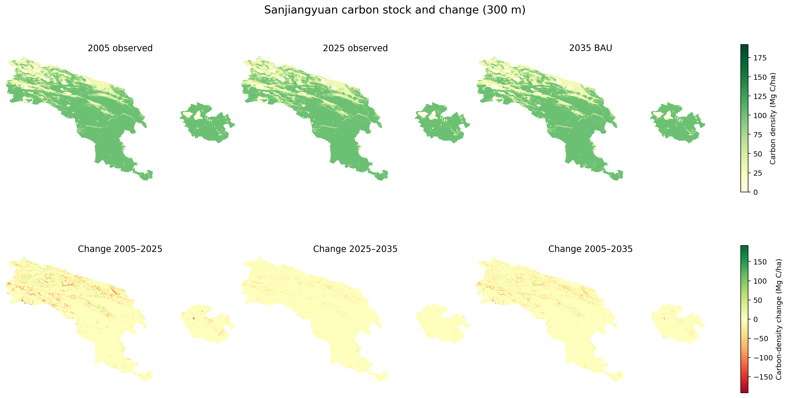

# 三江源土地覆盖变化、未来情景预测与碳储量评估

[](https://naturalcapitalproject.stanford.edu/software/invest)


一个面向三江源国家公园体制试点范围的端到端空间数据项目：处理2005—2025年土地覆盖数据，分析历史转移，利用机器学习构建2030/2035年BAU情景，并通过InVEST评估历史与未来碳储量，最终形成交互式Dashboard。

**在线展示：** [三江源碳景观 Dashboard](https://sanjiangyuan-carbon-dashboard.slyvia0717.chatgpt.site)（私有访问，需登录ChatGPT）



## 项目问题

- 2005—2025年三江源土地覆盖如何变化？
- 哪些土地转移是碳储量增减的主要来源？
- 在历史延续的BAU情景下，2030和2035年的土地覆盖可能呈现什么格局？
- 历史与未来碳储量变化在三个园区之间有何差异？

## 工作流


## 主要结果

| 年份 | 类型 | 碳储量（Mt C） | 较上一期变化（Mt C） |
|---|---|---:|---:|
| 2005 | 历史观测 | 1041.39 | — |
| 2010 | 历史观测 | 1036.71 | −4.68 |
| 2015 | 历史观测 | 1039.70 | +2.99 |
| 2020 | 历史观测 | 1015.54 | −24.16 |
| 2025 | 历史观测 | 1019.97 | +4.43 |
| 2030 | BAU预测 | 1013.10 | −6.87 |
| 2035 | BAU预测 | 1006.49 | −6.61 |

- 2005—2025年碳储量净减少约21.42 Mt C。
- 2025—2035年BAU情景下预计减少约13.48 Mt C。
- 2015—2020年是历史序列中碳损失最大的阶段，主要受草地与裸地之间的大面积转移影响。
- 2030/2035预测是探索性BAU情景，并非确定性预报。

## 模型与验证

机器学习使用2005→2010、2010→2015、2015→2020三个时期训练，以2020→2025作为独立时间验证。特征包括当前与上一期地类、近期变化、3×3和11×11邻域组成、高程、坡度、坡向及空间位置。

| 指标 | 模型 | “全部不变”基线 |
|---|---:|---:|
| 总体精度 | 0.950 | 0.961 |
| Kappa | 0.870 | 0.898 |
| 变化识别F1 | 0.345 | 0.000 |
| 变化召回率 | 0.334 | 0.000 |

研究区相邻时期约96%的像元不变，因此总体精度天然偏向不变基线。本项目公开变化识别能力与局限，不将高总体精度误解为高变化预测能力。

## 技术路线

- 空间处理：Rasterio、Shapely、PyProj、NumPy、SciPy
- 机器学习：scikit-learn Extra Trees、分层抽样、历史变化率约束
- 碳评估：InVEST Carbon Storage and Sequestration 3.20.2
- 可视化：Matplotlib、原生HTML/CSS/JavaScript
- 分析尺度：统一300米等积投影网格，研究面积约123,343 km²

## 仓库结构

```text
├── assets/                 # 研究区轻量边界
├── config/                 # 示例配置
├── dashboard/              # 可独立打开的静态Dashboard
├── docs/                   # 数据、方法、结果与复现说明
├── outputs/
│   ├── figures/            # 核心成果图
│   └── tables/             # Dashboard与分析表
├── parameters/             # 碳库参数与敏感性方案
├── portfolio/              # 简历与作品集文案
└── scripts/                # 核心处理、建模、复核脚本
```

大型GeoTIFF和原始CLCD未纳入仓库。参见[数据说明](docs/data.md)了解目录约定与复现方式。

## 快速查看

直接打开 `dashboard/index.html` 即可浏览随仓库附带的静态Dashboard。如果浏览器限制本地JSON读取，可在仓库根目录启动任意静态文件服务器，将站点目录指向 `dashboard/`。

完整复现需要Python 3.9+、InVEST 3.20.2、五期CLCD栅格和三个园区边界。安装依赖后，按照[复现指南](docs/reproducibility.md)依次运行脚本。

## 文档

- [数据来源与目录约定](docs/data.md)
- [方法与质量控制](docs/methodology.md)
- [成果说明](docs/results.md)
- [复现指南](docs/reproducibility.md)
- [项目局限性](docs/limitations.md)

## 数据与方法引用

- Yang, J. & Huang, X. (2021). The 30 m annual land cover dataset and its dynamics in China from 1990 to 2019. *Earth System Science Data*, 13, 3907–3925.
- Copernicus DEM GLO-30, 2021 release.
- Natural Capital Project, InVEST Carbon Storage and Sequestration model.

## 使用说明

本仓库不附带原始大体积数据，也不改变原始数据的许可条件。碳密度参数来自多来源整理并包含敏感性设定；使用者应根据研究目的、土层深度和区域实测资料重新校准。
